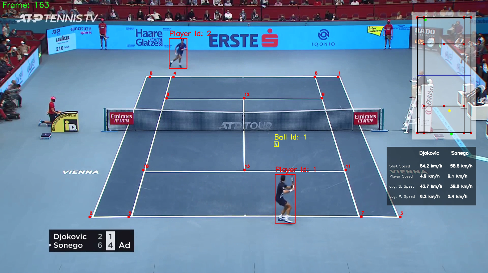

# Tennis Analysis

## Giới thiệu
Dự án này phân tích những người chơi Tennis trong một video để đo tốc độ, tốc độ đánh bóng và số lần đánh của họ. Dự án này sẽ phát hiện người chơi và quả bóng tennis bằng YOLO, đồng thời sử dụng CNN để trích xuất các điểm chính của sân. Dự án thực hành này là sự lựa chọn hoàn hảo để trau dồi kỹ năng học máy và thị giác máy tính của bạn.
## Kết quả
Đây là ảnh chụp màn hình video kết quả:

## Mô hình sử dụng
* YOLO v8 để phát hiện người chơi
* Tinh chỉnh mô hình YOLO để phát hiện quả bóng tennis trên sân
* Trích xuất các điểm chính trên sân

* Kết quả train mô hình YOLOV8 (yolov8_best.pt): https://drive.google.com/file/d/1nYbG6F9zIqi1BmyxOuNRWxQ4wbHIwMV1/view?usp=drive_link
* Kết quả train mô hình phát hiện điểm chính trên sân (keypoints_resnet_101.pth): https://drive.google.com/file/d/1oT1YjaWLm_kOyD5u6oK-BBO3rG0KC7AW/view?usp=drive_link

## Quá trình đào tạo
* Mô hình phát hiện bóng trên sân tennis sử dụng YOLO: training/tennis_ball_detector_training.ipynb
* Mô hình phát hiện điểm chính trên sân tennis sử dụng Pytorch: training/tennis_court_keypoints_training.ipynb

## Các yêu cầu về phiên bản, thư viện
* Python 3.11
* ultralytics
* pytorch
* pandas
* numpy 
* opencv
